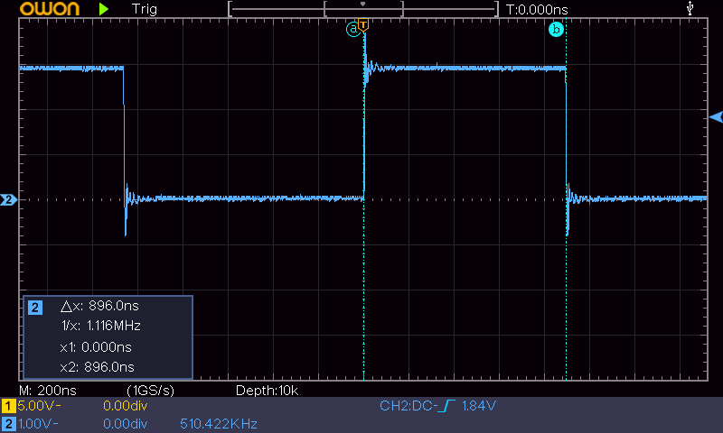
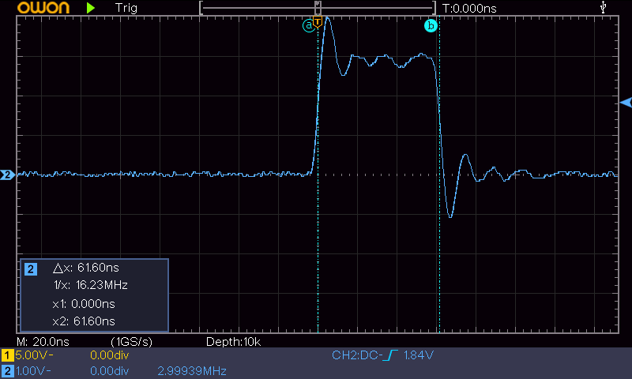
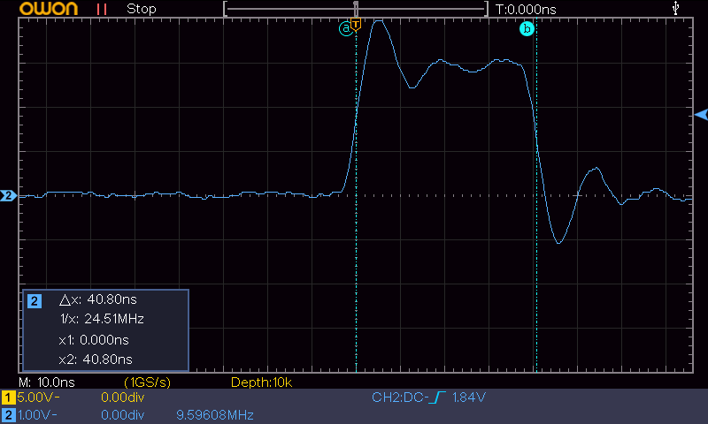
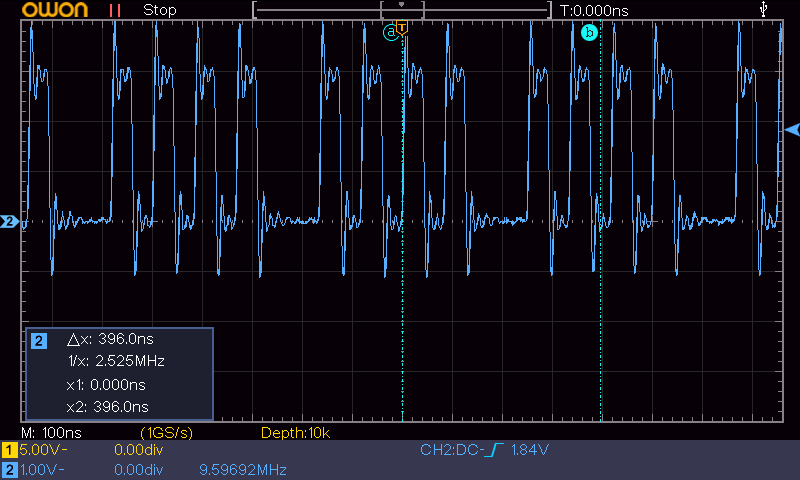

# STM32F0 GPIO Speed Benchmark: HAL vs Registers

🌐 **Read me in English** | [Читати мене Українською](README_uk.md)

An educational embedded benchmark project analyzing and measuring the hardware/software overhead of the STMicroelectronics HAL (Hardware Abstraction Layer) library compared to direct register access (CMSIS). Tested on **STM32F072 Discovery** and verified with **OWON SDS210S** oscilloscope.

## 🎯 Project Goal
As an aspiring Junior Embedded Engineer, I wanted to dive "under the hood" of MCU peripherals. The goal of this experiment is to measure the atomic pin toggling speed (0 → 1 → 0) using two different approaches and understand how compiler optimization levels affect the final machine code and hardware behavior.

## 🛠️ Hardware & Toolchain
- **MCU:** STM32F072RBT6 (ARM Cortex-M0 @ 48 MHz)
- **Development Board:** 32F072BDISCOVERY
- **IDE / Compiler:** Keil uVision5 (Arm Compiler 6 / AC6)
- **Configuration Tool:** STM32CubeMX
- **Measurement Tool:** OWON SDS210S Digital Oscilloscope (100 MHz, 1 GS/s)

## ⚙️ Hardware Setup
To ensure precise measurements without hardware-induced signal distortion, the following settings were applied via STM32CubeMX:
- **Core Clock (HCLK):** Maxed out at **48 MHz** (driven by external HSE quartz via PLL).
- **GPIO Pin:** `PC8` (Orange LED).
- **GPIO Maximum Output Speed:** Configured to **High Speed**.

## 💻 Code Snippets
The project uses a single `main.c` file. Toggling modes are switched by commenting/uncommenting the corresponding blocks inside the main `while(1)` loop:

```c
while (1)
{
  /* --- APPROACH 1: ST HAL Library --- */
  // HAL_GPIO_WritePin(GPIOC, GPIO_PIN_8, GPIO_PIN_SET);
  // HAL_GPIO_WritePin(GPIOC, GPIO_PIN_8, GPIO_PIN_RESET);

  /* --- APPROACH 2: Direct Register Access (CMSIS) --- */
  GPIOC->BSRR = GPIO_BSRR_BS_8;  // Set PC8 High
  GPIOC->BSRR = GPIO_BSRR_BR_8;  // Set PC8 Low
}
```

## 📊 Benchmark Results

| Optimization Level | HAL Pulse Width (Δ t) | BSRR Pulse Width (Δ t) | Duration Ratio (HAL / BSRR) | Notes & Key Observations |
| :---: | :---: | :---: | :---: | :--- |
| **`-O0`** | 896.0 ns | 61.60 ns | **14.5x** | Huge HAL overhead due to runtime parameters validation and nested calls. |
| **`-O1`** | 418.0 ns | 61.60 ns | **6.8x**  | Compiler optimizes HAL functions structure; BSRR remains stable. |
| **`-O2`** | 396.0 ns | 40.80 ns | **9.7x**  | HAL functions are inlined. BSRR hits peak efficiency. |
| **`-O3`** | 396.0 ns | 40.80 ns | **9.7x**  | Identical to -O2; absolute hardware switching limit achieved. |

## 🔬 Oscilloscope Captures

### 1. HAL Library Implementation (-O0 vs -O3)
*HAL toggling speed improves significantly with optimization, but function calls still introduce overhead:*

| Optimization -O0 (No Optimization) | Optimization -O3 (Maximum) |
| :---: | :---: |
|  |  |

### 2. Direct Register Access Implementation (-O0 vs -O3)
*Direct BSRR writes hit the absolute hardware clock speed limits:*

| Optimization -O0 (No Optimization) | Optimization -O3 (Maximum) |
| :---: | :---: |
|  |  |

### 3. Visual confirmation of signal non-uniformity
*Under high optimization (-O2, -O3), the BSRR pulse train becomes non-uniform. The tightly grouped bursts represent sequence register writes, while the wider gaps show the execution of the loop boundary jump:*

| Loop Unrolling Phenomenon (BSRR @ -O3) |
| :---: |
|  |

## 🔬 Advanced Engineering Analysis

### 1. The 2-Clock Physical Limit (`BSRR` @ `-O2`/`-O3`)
At 48 MHz, a single CPU clock cycle takes exactly 1 / 48,000,000 ≈ 20.83 ns. 
My oscilloscope captured a peak register pulse width of **40.80 ns**, which translates to **exactly 2 CPU clock cycles** (1 cycle for setting the bit via `BSRR`, and 1 cycle for resetting it). This proves that direct register access drives the Cortex-M0 core to its absolute theoretical hardware limits.

### 2. High-Frequency Ringing (Signal Integrity)
At high switching rates (pulse width < 100 ns), significant high-frequency oscillations ("ringing") are visible on the waveform edges. 
* **Cause:** This is a classic signal integrity artifact. Because the GPIO speed is set to *High*, the slew rate is extremely fast (sharp edges). The ground lead ("alligator clip") of the oscilloscope probe acts as an inductor, forming an LC resonant circuit with the scope's input capacitance. 

### 3. Compiler and Flash Architecture Artifact (Non-uniform Pulse Train)
During the experiment, a fascinating anomaly was discovered: at `-O0` and `-O1`, the pulse sequence was completely uniform. However, at `-O2` and `-O3`, the `BSRR` signal train became **non-uniform (grouped in periodic packets with a missing pulse after every 4 cycles)**.

* **Analysis & Hypotheses:**
  This behavior is a complex result of compiler behavior combined with the **STM32F0 Flash memory architecture**. According to the STMicroelectronics reference manual, the Flash interface has a frequency limit of 24 MHz. Since the core clock (HCLK) is maxed out at 48 MHz, **1 wait state** is required to read instructions from Flash.
  
  There are two highly probable factors causing these timing irregularities:
  1. **Prefetch Buffer & Branch Penalties:** At higher optimization levels (`-O2`/`-O3`), the execution loop becomes extremely tight and fast. At this boundary, the processor experiences periodic internal stalls due to instruction fetch misses in the prefetch buffer during the loop jump (`while(1)` branch instruction), requiring a buffer refill.
  2. **Loop Unrolling:** The compiler may have unrolled the loop partially, and the wider gaps represent the execution overhead of the loop boundary jump, while the tight pulse groups represent back-to-back register modifications.


## 💡 Conclusion
While the STMicroelectronics HAL library drastically simplifies development and improves code portability across different STM32 families, it introduces massive performance penalties (up to 14.5x slower execution). For strict real-time applications, time-critical protocols, or low-overhead interrupt handlers, direct register modification via CMSIS combined with high compiler optimization (`-O2`/`-O3`) is mandatory.
